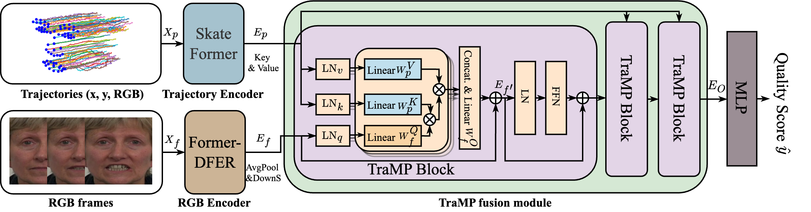
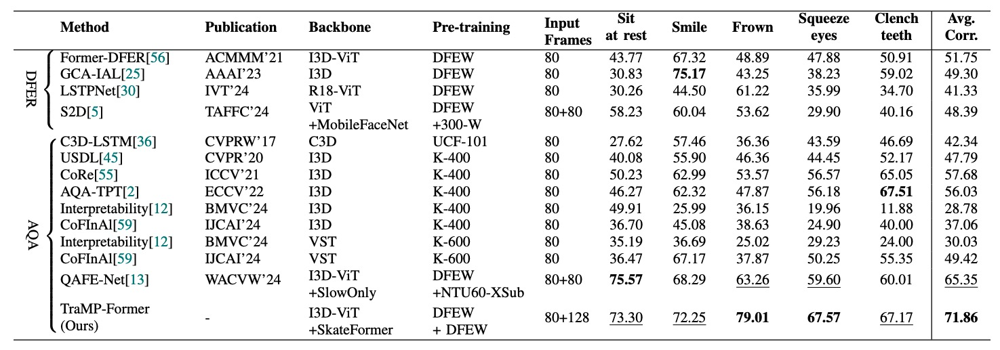
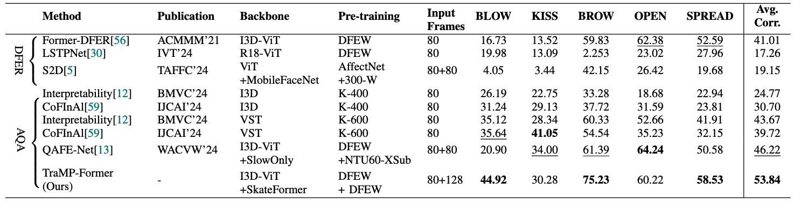

# TraMP-Former
This is the PyTorch implementation for: Trajectory-guided Motion Perception for Facial Expression Quality Assessment in Neurological Disorders
[arXiv version](https://arxiv.org/abs/2504.09530)


We introduce Trajectory-guided Motion Perception Transformer (TraMP-Former), a novel FEQA framework that fuses landmark trajectory features for fine-grained motion capture with visual semantic cues from RGB frames, ultimately regressing the combined features into a quality score.



## Get Started

### Data Download

1: [PFED5 dataset](https://github.com/shuchaoduan/QAFE-Net)
Please use the above link to access the video frames of PFED5, but you can download the [trajectory data](https://drive.google.com/file/d/1Hw_Bkf2yzGbvGobtb2Rr8NkjyfvueHLF/view?usp=sharing) here.

2: [Toronto NeuroFace dataset](https://slp.utoronto.ca/faculty/yana-yunusova/speech-production-lab/datasets/). 
The list of start and end frame index to split for the augmented version is provided in `data/Toronto_NeuroFace_split.csv` file. 

### Training and Testing on PFED5
run ```python main_rgb1x1_128.py --class_idx 1 --batch_size 4```

### Pretrained Weights
Download pretrained weights (RGB encoder and trajectory encoder) from [Google Drive](https://drive.google.com/drive/folders/1BM9wnYs2_n8Y57Nb5RCSzHeV9weR9MVN?usp=sharing). Put the files under `models/pretrained_weights` folder.

	```
	- models/pretrained_weights/
		 FormerDFER_DFEW.pth
		 SkateFormer_256_rgb1x1.pth
	```
 
 ### Evaluation Results
Results on PFED5


Results on augmented Toronto NeuroFace


## Citations
If you find our work useful in your research, please consider giving it a star ⭐ and citing our paper in your work:

```
@misc{tramp-former,
      title={Trajectory-guided Motion Perception for Facial Expression Quality Assessment in Neurological Disorders}, 
      author={Shuchao Duan and Amirhossein Dadashzadeh and Alan Whone and Majid Mirmehdi},
      year={2025},
      eprint={2504.09530},
      archivePrefix={arXiv},
      primaryClass={cs.CV},
}

```

## Acknowledgement
We gratefully acknowledge the contribution of the Parkinson’s study participants. The clinical trial from which the video data of the people with Parkinson’s was sourced was funded by Parkinson’s UK (Grant J-1102), with support from Cure Parkinson’s. Portions of the research here uses the Toronto NeuroFace Dataset collected by Dr. Yana Yunusova and the Vocal Tract Visualization and Bulbar Function Lab teams at UHN-Toronto Rehabilitation Institute and Sunnybrook Research Institute respectively, financially supported by the Michael J. Fox Foundation, NIH-NIDCD, Natural Sciences and Engineering Research Council, Heart and Stroke Foundation Canadian Partnership for Stroke Recovery and AGE-WELL NCE.


